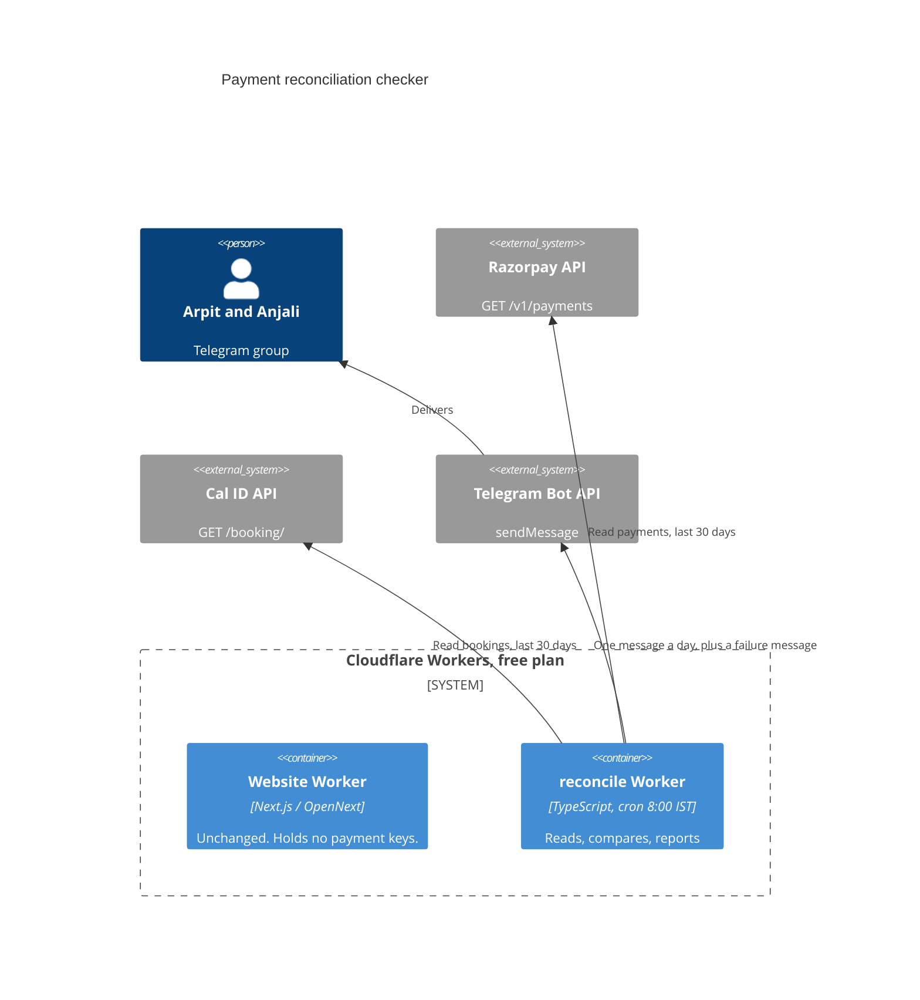

# Payment reconciliation checker — design

Date: 2026-09-26
Status: draft, awaiting Arpit's review

## Goal

Make sure no customer's money is stuck and Anjali is never unpaid, by comparing
Razorpay (where the money is) with Cal ID (which bookings exist) every day and
telling Arpit and Anjali on Telegram about anything that does not match.

Success:
- A mismatch that exists in the data at 8:00 IST is reported in that morning's
  message, and stays reported until resolved.
- A day with no problems still produces a short summary, so silence always
  means the checker is broken.
- The checker never changes money or bookings. It only reads.
- Running cost stays at zero.

## Decisions (agreed in conversation, 2026-09-26)

| Topic | Decision |
|---|---|
| Approach | Pull. Each morning the checker fetches payments from the Razorpay API and bookings from the Cal ID API. Webhook-only push was rejected: a missed delivery makes a payment invisible. |
| Where it runs | A separate Cloudflare Worker (`workers/reconcile/`) on the free plan, with a cron trigger. Not inside the website's Worker, so the live keys never sit in the public site. |
| Alerts | Telegram bot, posting to a group with Arpit and Anjali. |
| Heartbeat | A summary every morning, even when all is fine. No message by 9:00 IST means the checker is broken. |
| Schedule | Daily at 8:00 IST (`30 2 * * *` UTC). |
| Actions | Read-only. Refunds, bookings and cancellations stay manual. |
| Language | English. |

## Out of scope

- Instant (real-time) alerts through Razorpay or Cal ID webhooks. Can be added
  later without redesign.
- Any automatic refund, booking or cancellation.
- A database. The checker is stateless (see "Still open without storage").
- An external dead-man's switch (Healthchecks.io). Optional later.

## Architecture



### Units

Each unit has one job and can be tested alone.

| File (`workers/reconcile/src/`) | Job | Depends on |
|---|---|---|
| `index.ts` | `scheduled` handler: fetch, reconcile, format, send. Catches every error and sends the failure message. `fetch` handler returns 404 (no public endpoint). | all below |
| `http.ts` | `getJson(url, headers)`: GET only (throws on any other method), 10 s timeout, 3 retries with backoff on 429 and 5xx. | — |
| `razorpay.ts` | `listPayments(from, to)` and `listOrders(from, to)`: page through `GET /v1/payments` and `GET /v1/orders` (`count=100`, `skip`) sharing one paging helper. Basic auth with key ID and secret. | `http.ts` |
| `calid.ts` | `listBookings(afterCreated)`: pages through `GET https://api.cal.id/booking/` for each of `upcoming`, `past`, `cancelled`, `unconfirmed` (the endpoint defaults to `upcoming` and has no "all"). Bookings seen in two buckets are counted once. Bearer auth. | `http.ts` |
| `reconcile.ts` | Pure function `reconcile(payments, orders, bookings, unreadable, now) → Report`. No I/O. | — |
| `format.ts` | Pure function `format(report, now) → string` (Telegram message). | — |
| `telegram.ts` | `send(text)`: `POST sendMessage` to the group. The only non-GET call, and only to Telegram. Retries 3 times. | — |

The GET-only rule is enforced in `http.ts`, and `telegram.ts` does not use it.
A test fails if any Razorpay or Cal ID call uses another method.

## Data

Confirmed against the live APIs in Stage 0 (2026-09-27; see "Confirmed in Stage 0" below).

- **Razorpay payments:** created in the last 30 days. Fields used: `id`,
  `order_id`, `status` (`created`, `authorized`, `captured`, `refunded`,
  `failed`), `amount`, `amount_refunded`, `created_at`.
- **Razorpay orders:** fetched from one day before the payments/bookings
  window. In practice an order follows its booking by a couple of seconds, so
  this margin is generous, not load-bearing — one extra Razorpay call is
  cheaper than reasoning precisely about the window's edge. Fields used:
  `id`, `amount`, `created_at`.
- **Cal ID:** bookings created in the last 30 days, all four status buckets.
  Fields used: `id`, `uid`, `status`, `paid`, `startTime`, `createdAt`,
  `fromReschedule`, `attendees[0].name`, `eventType.price` (optional; falls
  back to 0 when the event type was later deleted — `payment[].amount` is
  always Cal ID's own charge and is trusted instead), and `payment[]`
  (`paymentOption`, `amount`, `currency`, `success` — no `externalId`, no
  `refunded`).

**The link between a booking and its payment.** Cal ID's `payment[]` records
carry no field shared with Razorpay (no order ID, and the payment
`description`'s `#…` value matches nothing in Cal ID). Stage 0 found that for
every booking with a payment record, exactly one Razorpay order was created
1–3 s afterwards, same amount. The link is therefore by time, at the level of
a whole reschedule chain rather than one booking (R18): a chain "has a
charge" when any booking in it has a `payment[]` record with `amount > 0`
(the first such record, searching the chain, sets the expected amount), and
its candidate orders are those within **120 seconds** of *any* booking's
`createdAt` in the chain — the order is stamped when it was first created,
which can predate a reschedule by any amount (a payment record that moves to
the rescheduled booking still finds an order timed against the original).

Among a chain's candidate orders, selection (R17) tries proximity first and
amount second: if the nearest candidate is within 10 s and at least 10 s
closer than the next-nearest, it is trusted on timing alone (Cal ID/Razorpay's
own 1–3 s gap makes this decisive almost always, including telling an
abandoned checkout's order apart from a same-day retry's); otherwise, the
amount narrows the field, and exactly one same-amount candidate is linked.
Anything else — no candidate resolves it, or two chains settle on the same
order — can't be trusted. It is reported as `cant_verify` and never linked,
and, importantly, ambiguity alone is never promoted to a red finding: a
payment whose order is one of an ambiguous chain's candidates gets its own
`cant_verify` instead of `paid_no_booking`, and the chain itself is exempted
from `booking_no_payment` (its `cant_verify` already says a human is needed).

Once a chain is linked to an order, the existing exact link from a Razorpay
**payment** to its **order** (`order_id`) carries the match the rest of the
way. `booking.paid` is used only as a cross-check: an accepted,
apparently-paid booking with no linked payment gets a more specific detail
line rather than a new rule.

## Checks

Windows: problems are looked for over the last **30 days**. Summary counts
cover the **previous IST calendar day**. Payments created in the last
**30 minutes** are skipped (a booking may still be completing).

| Finding | Rule | Severity |
|---|---|---|
| Matched | Captured payment linked to an accepted booking, amount = Cal ID's payment record | ✅ counted |
| Paid, no booking | Captured payment (not fully refunded) linked to no booking. Anjali takes no other Razorpay payments, so every unlinked payment is treated as this. | 🔴 |
| Paid, booking not confirmed | Captured payment linked to a booking that is still pending | 🔴 |
| Booking, no payment | Accepted booking with price > 0 and no captured payment on it or on its reschedule chain. Not raised when the chain starts with a reschedule of a booking older than the 30-day window (that original was checked while it was in the window). Pending bookings without payment are abandoned checkouts; cancelled or rejected ones without money need nothing. | 🔴 |
| Double charge | More than one captured payment linked to one booking | 🔴 |
| Wrong amount | Razorpay's captured amount ≠ the amount in Cal ID's payment record for the same payment. (Not the current event price: a later price change must not flag old bookings.) | 🔴 |
| Held, not taken | Payment `authorized` for more than 24 hours | 🟠 |
| Can't verify | Any record whose shape or status the checker does not recognise | 🟠 |
| Older than 30 days | A problem whose payment or booking is about to leave the window | 🔴 "check manually" |
| Cancelled, not refunded | Cancelled booking with a captured, unrefunded payment | 🟡 listed, human decides |
| Refunded | Payment with `amount_refunded > 0` | ℹ️ listed |
| Failed | `failed` payment with no booking | counted only |
| Free | Booking with price 0 and no kept payment | ignored |

**Reschedules.** Cal ID creates a new booking and links it with
`fromReschedule`; the payment stays on the original. A booking is paid if any
booking in its chain has a captured payment.

**Still open without storage.** No database. Each run recomputes everything
over 30 days, and "open since" is the payment's or booking's own date. A
problem therefore repeats every morning until fixed, and gives a final
"check manually" line before it leaves the window.

## Messages

One message a day to the group, in this order: 🔴, 🟠, 🟡, ℹ️, then the ✅ counts.
Every problem ends with a `→` line saying what to do. Times in IST, amounts in ₹.
Only first names, amounts, times and shortened IDs. No phone numbers or emails.

Quiet day:

```
✅ Payments check · Sat 26 Sep, 8:00
Yesterday: 3 paid bookings, 3 payments, all matched.
Captured ₹6,453 · Refunded ₹0
Nothing needs you today.
```

Problem day:

```
🔴 Payments check · Sat 26 Sep, 8:00 · 1 needs action

🔴 Paid, but no booking (customer waiting)
   Priya · ₹2,151 · paid Fri 25 Sep, 9:42 pm
   Payment pay_Tgcy… · Order order_Tgcu…
   → WhatsApp her: book a slot for her in Cal ID, or refund in Razorpay.

🟠 Still open since Thu 24 Sep
   Booking without payment: Rahul · Mon 28 Sep 11:00
   → Check Cal ID; cancel the booking if he didn't pay.

✅ Also: 2 bookings matched, ₹4,302 captured.
```

A day whose only findings are 🟡 has the header `🟡 Payments check · <date> · N to decide`; an
orange-only day uses 🟠. "Nothing needs you today." appears only when there is nothing red,
orange or yellow.

Checker failure (sent as a separate message):

```
⚠️ Payments check FAILED · Sat 26 Sep, 8:00
Cal ID rejected the API key (401).
Payments were NOT checked today.
→ Tell Arpit. Until fixed, compare Razorpay and Cal ID by hand.
```

## Secrets

Cloudflare secrets on the `reconcile` Worker only. Never in the repository,
chat, or the website Worker. The one exception is Stages 0 and 2 below, which
run on Arpit's laptop from `workers/reconcile/.dev.vars` (git-ignored). The
live Razorpay key is deleted from that file as soon as Stage 2 passes.

| Secret | Source |
|---|---|
| `RAZORPAY_KEY_ID`, `RAZORPAY_KEY_SECRET` | Razorpay, Live mode → API Keys |
| `CALID_API_KEY` | Cal ID → Settings → Developer → API keys |
| `TELEGRAM_BOT_TOKEN` | @BotFather |
| `TELEGRAM_CHAT_ID` | The group's chat ID |

Razorpay has no read-only keys, so the live key can issue refunds. Controls:
GET-only code with a test that enforces it; the key exists in one place;
two-factor login on Cloudflare, Razorpay and GitHub; rotate the key at once on
any doubt.

## Errors

- Razorpay or Cal ID still failing after retries: the run is **FAILED**. Send
  the ⚠️ message. Never send a partial "all good".
- Unexpected response shape: 🟠 "can't verify", never a silent pass.
- Telegram failing after retries: log to Workers logs (observability on). It
  cannot reach anyone; the missing 8:00 message is the alarm.
- Free-plan limits: 50 subrequests per run (7 in normal use: 1 Razorpay
  payments call, 1 Razorpay orders call, 4 Cal ID status buckets, 1
  Telegram; more only if a bucket or a Razorpay list needs extra pages);
  10 ms CPU per run (network waits do not count).

## Testing

**Stage 0 — link spike.** Arpit creates the Cal ID API key and puts it in
`workers/reconcile/.dev.vars`. Fetch the two ₹1 test bookings (28 Sep and 2 Oct,
both cancelled) and compare their `payment[]` records with the Razorpay payment
details (`pay_TgcygiA2l1uIvi`, `order_TgcuzrsNwu3g8d`, `#Tgcuxtuy4btbn9`).
Record the link field here. Then confirm, with one GET using the live key, that
Anjali's own Razorpay key lists payments created through Cal ID's app. If it
does not, stop and redesign.

**Stage 1 — unit tests (vitest), written before the code.** One test per row
of the Checks table, plus: reschedule chain, 30-minute grace, 30-day edge,
summary day boundary in IST, message order and wording, GET-only guard,
retry and timeout behaviour, failure message on API error.

**Stage 2 — dry run.** Run against the real accounts with `DRY_RUN=1`, which
prints the message instead of sending. Compare by eye with both dashboards.

**Stage 3 — live.** Deploy. Trigger one run. Then:
1. Wrong Cal ID key → ⚠️ FAILED arrives. Restore the key.
2. Book the hidden ₹1 event, pay, cancel without refund → next morning shows
   🟡. Refund → following morning shows ℹ️.
3. A normal morning → ✅ summary at 8:00.

**Stage 4 — first real payment.** Check the fee is 2% + GST and the summary
counts it.

## Deployment

- Folder `workers/reconcile/` with its own `package.json`, `wrangler.jsonc`,
  `tsconfig.json` and tests. The website's build, lint and dependencies are
  not changed; the root ESLint config ignores the folder if needed.
- A second Cloudflare Workers Builds project from the same repository, root
  directory `workers/reconcile`, production branch `main`.
- `observability.enabled: true` so failed Telegram sends are visible in logs.

## Related action, outside this build

Cal ID has a per-event **Refund Policy** (Always / Never / if cancelled N days
before) that refunds automatically. The site's policy is "no cancellations;
refunds only for a genuine cause". Set it to **Never** on both event types, and
consider turning off booker cancellation. Refunds for genuine causes are then
issued by hand in Razorpay.

## Confirmed in Stage 0 (2026-09-27)

- The booking–payment link field: there isn't one. Cal ID's `payment[]`
  records have no `externalId` and no `refunded`, only `paymentOption`,
  `amount`, `currency`, `success`. Linked by time instead (see Data, above).
- Anjali's live Razorpay key does list payments created through Cal ID's app.
- Cal ID's list endpoint returns `payment[]` per booking, so one call per
  status bucket is enough; no per-booking calls needed.
- `booking.paid` is a reliable boolean on every booking, used as a
  cross-check on top of the time-based link.
- `eventType.price` is 0 (and `currency` "usd") when the event type was later
  deleted; `payment[].amount` stays correct and is what the checker trusts.
- Statuses observed live: `PENDING` (abandoned checkout: `paid:false`,
  `payment[0].success:false`) and `CANCELLED`. `ACCEPTED`, `REJECTED`,
  `AWAITING_HOST` remain valid but unobserved so far.
- Timing: for every booking with a payment record, exactly one Razorpay order
  was created 1–3 seconds after `booking.createdAt`, same amount.
